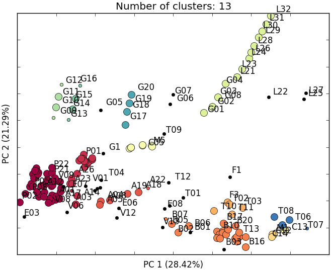

# CVRPFeatureExtractors
A large collection of implemented feature extractors for capacitated vehicle routing problems



_A set of classical CVRP instances clustered using the computed features (Rasku et al. 2016)_

# Usage

[Configure](https://github.com/yorak/CVRPFeatureExtractors#configuring) and run `main.py` using Python 2.7 and with [all of the other dependencies installed](https://github.com/yorak/CVRPFeatureExtractors#dependencies).

# Input and Output

Reads [TSPLIB formatted](http://comopt.ifi.uni-heidelberg.de/software/TSPLIB95/) formatted `.vrp` files and outputs `.csv`files with around 400 columns (features), with each line describing a single CVRP instance.

# Configuring

* Set the PYTHONPATH to point to the `CVRPFeatureExtractors` folder
* Change the `ACOTSP_EXE_PATH` in `tsp_solver.py` to point to the ACOTSP executable
* Compile the VRPH binaries and SYMPHONY binaries and place them into `solvers`folder
* Change the folders path in `main.py/main()` to point to the actual folders the `.vrp` files reside in

# Dependencies

* Python 2.7
* Numpy - for vector and matrix operations
* sklearn - for min-max scaling, PCA, clustering, and MDS
* scipy - for convenient distance matrix calculation and statistics
* networkx - for calculating digraph nearest neighbor features
* matplotlib and PIL (OPTIONAL) - for plotting clusters (analyze_clusters.py only)

It is recommended to use Anaconda Python distribution, Spyder IDE, and a virtual environment to manage the dependencies. The environment with also the IDE and other tools (i.e., with the anaconda package) can be initialized with a following command:

```console
$ conda create --name featureextraction python=2.7 anaconda numpy scipy networkx scikit-learn
$ conda activate featureextraction
$ spyder
```
In addition, you need to compile some external executables, e.g., preferably with GCC, and place them to the `solvers` folder:

* [custom VRPH](https://github.com/yorak/VRPH/tree/local_search_stats) init executable - used for local search probing
* [SYMPHONY](https://projects.coin-or.org/SYMPHONY) branch-and-cut solver - used in the MIP probing
* [custom ACOTSP](https://github.com/juherask/ACOTSP) TSP solver - which has an option to disable ant system, it is used to solve TSPs fast and accurately when estimating the tightness of the constraints

# TODO

* Add support for XML CVRP instances (use helpers.cvrp_rkm16_io/read_TSPLIB_CVRP() as a template)
* Add a command line user interface to main.py, e.g., by using argparse
* Try to find the ACOTSP from the `solvers` folder before resorting to hard coded `ACOTSP_EXE_PATH` for the exe
* Write unit tests to verify correct operation of the extractors  

# Citing 

Rasku, J., Kärkkäinen, T., Musliu, N.: *Feature extractors for describing vehicle routing problem instances*. In: SCOR'16, OASICS, vol. 50, pp. 7:1–7:13. Dagstuhl Publishing (2016)
